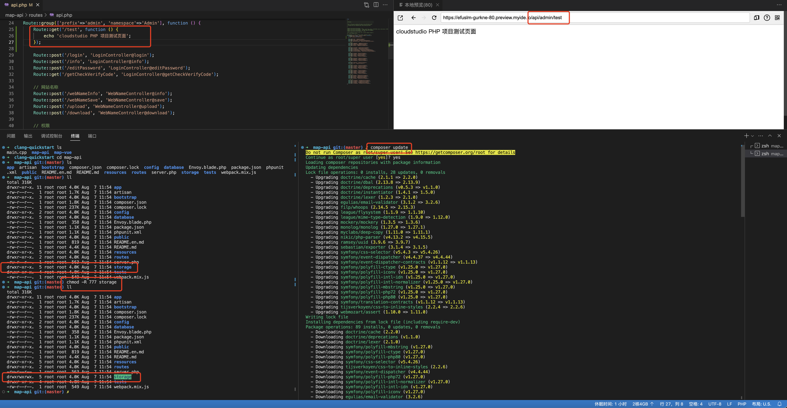

> 本项目来源于[《腾讯云 Cloud Studio 实战训练营》](https://marketing.csdn.net/p/06a21ca7f4a1843512fa8f8c40a16635)的参赛作品，该作品在腾讯云 [Cloud Studio](https://www.cloudstudio.net/?utm=csdn) 中运行无误。

Cloud Studio 活动演示案列代码。

---

# 一、Cloud Studio 介绍：

[Cloud Studio](https://www.cloudstudio.net/?utm=csdn)是基于浏览器的集成式开发环境（IDE），为开发者提供了一个稳定的云端工作站。用户在使用 [Cloud Studio](https://www.cloudstudio.net/?utm=csdn) 时无需安装，随时随地打开浏览器就能使用。其功能包含代码高亮、自动补全、Git 集成、终端等 IDE 的基础功能，同时支持实时调试、插件扩展等，可以帮助开发者快速完成各种应用的开发、编译与部署工作。


---

# 二、系统技术体系：


Vue项目npm run dev，通过本地proxy代理访问后端PHP的项目技术体系结构。


项目页面功能截图快照。


---

# 三、安装软件：

## 1. 安装PHP 7.3、PHP 7.3 -FPM、PHP 7.3 相关扩展：

```shell
# 1. 添加对其他软件源的管理
# -y 标志表示自动同意安装，没有它，将在终端窗口中收到每次安装的提示
sudo apt -y install software-properties-common

# 2. 安装存储库 ppa:ondrej/php,它将提供所有 PHP 版本
sudo add-apt-repository ppa:ondrej/php

# 3. 更新apt-get源，以便包管理器可以看到新列出的包
sudo apt-get update

# 4. 安装php、fpm和php相关扩展
sudo apt-get install -y php7.3 php7.3-fpm php7.3-xml php7.3-mbstring php7.3-gd php7.3-mcrypt php7.3-curl php7.3-mysql

# 5. 创建php进程文件
mkdir /run/php
touch /run/php/php7.3-fpm.pid
```

---

## 2. 修改php-fpm的配置，当配置PHP时,需要使用127.0.0.1:9000时,以下需要手动修改fpm的配置文件.

```shell
# 1. 修改fix_pathinfo:
sudo vim /etc/php/7.3/cli/php.ini
# 2.输入/fix_pathinfo搜索
;cgi.fix_pathinfo=1                      =>  修改为cgi.fix_pathinfo=0

# 2. 修改listen:
sudo vim /etc/php/7.3/fpm/pool.d/www.conf
listen=/run/php/php7.3-fpm.sock          =>   修改为listen=127.0.0.1:9000,使用9000端口
# 3. 子进程的数量:
pm.max_children=5                        =>   修改为20(看自己需求)

# 4. 重启php-fpm:
service php7.3-fpm restart
```

修改完后，使用cat结合命令进行查看配置文件变化。

```js
cat /etc/php/7.3/cli/php.ini | tail -n +785 | head -n 10
cat /etc/php/7.3/fpm/pool.d/www.conf | tail -n +25 | head -n 13
```


---

## 3. 安装PHP的包管理工具。

```js
php -r "copy('https://install.phpcomposer.com/installer', 'composer-setup.php');"
php composer-setup.php
php -r "unlink('composer-setup.php');"
sudo mv composer.phar /usr/local/bin/composer
```


---

## 4. 安装Nginx：

安装Nginx web服务。

```js
sudo apt-get install -y nginx
```

修改默认的default配置文件。

```js
server {
    listen 80;
    # 指定根目录指向的绝对地址
    root /workspace/clang-quickstart/map-api/public;
    # Add index.php to the list if you are using PHP
    index index.php index.html index.htm index.nginx-debian.html;

    server_name _;

		# 增加php解析
    location / {
        # First attempt to serve request as file, then
        # as directory, then fall back to displaying a 404.
        try_files $uri $uri/ /index.php?$query_string;
    }

    location ~ \.php$ {
        include snippets/fastcgi-php.conf;
        fastcgi_pass 127.0.0.1:9000;
    }
}
```

启动Nginx服务。

```js
nginx
# 表示重启nginx服务 
nginx -s reload
```

---

## 5. 安装 Node 服务。

```js
apt-get install -y nodejs
apt-get install -y npm
```

---

## 6. docker 搭建 MySQL。

```js
docker pull mysql:5.7
docker run -p 3306:3306 --name mysql -e MYSQL_ROOT_PASSWORD=123456 -d mysql:5.7 --character-set-server=utf8mb4 --collation-server=utf8mb4_general_ci
```

---

# 四、创建数据库及导入测试数据：

```
create database map CHARSET utf8 COLLATE utf8_general_ci;

use map;

CREATE TABLE `data_admin` (
  `id` int(11) NOT NULL AUTO_INCREMENT,
  `guid` char(32) NOT NULL COMMENT '管理员guid',
  `username` varchar(255) NOT NULL COMMENT '用户ID',
  `password`   char(32) NOT NULL COMMENT '密码',
  `status` tinyint(1) NOT NULL COMMENT '状态:1为启用 2为禁用',
  `token` char(32) NOT NULL COMMENT 'token值',
  `role_id` int(11) NOT NULL DEFAULT 0 COMMENT '角色id',
  `update_time` int(11) NOT NULL DEFAULT 0 COMMENT '更新时间',
  `login_time` int(11) NOT NULL DEFAULT 0 COMMENT '最后登陆时间',
  PRIMARY KEY (`id`)
) ENGINE=InnoDB DEFAULT CHARSET=utf8;

# admin adminadmin
insert into data_admin (guid, username, password, status, token) values ('a727d3819e4c9bb19d3c93ccdad81eff', 'admin', 'a727d3819e4c9bb19d3c93ccdad81eff', 1, '');

CREATE TABLE `data_webname` (
  `id` int(11) NOT NULL AUTO_INCREMENT,
  `name` varchar(255) NOT NULL COMMENT '网站名称',
  PRIMARY KEY (`id`)
) ENGINE=InnoDB DEFAULT CHARSET=utf8;

CREATE TABLE `data_role` (
  `id` int(11) NOT NULL AUTO_INCREMENT,
  `name` varchar(255) NOT NULL COMMENT '权限名称',
  `update_time` int(11) NOT NULL DEFAULT 0 COMMENT '更新时间',
  PRIMARY KEY (`id`)
) ENGINE=InnoDB DEFAULT CHARSET=utf8;

insert into data_role (id, name, update_time) values (1, '管理员', 1691656066);

CREATE TABLE `data_role_action` (
  `id` int(11) NOT NULL AUTO_INCREMENT,
  `type` tinyint NOT NULL COMMENT '类型: 1. 路由权限 2. 按钮权限 3. 一级模块',
  `name` varchar(255) NOT NULL DEFAULT '' COMMENT '权限名称',
  `action` varchar(255) NOT NULL DEFAULT '' COMMENT '权限值',
  `parent_id` int(11) NOT NULL DEFAULT 0 COMMENT '父级id',
  PRIMARY KEY (`id`)
) ENGINE=InnoDB DEFAULT CHARSET=utf8;


insert into data_role_action (id, type, name, action, parent_id) values (1, 3, '地图', '', 0);
insert into data_role_action (id, type, name, action, parent_id) values (2, 3, '地图显示', '', 0);
insert into data_role_action (id, type, name, action, parent_id) values (3, 1, '台账', '1', 1);

CREATE TABLE `rel_role_action` (
  `id` int(11) NOT NULL AUTO_INCREMENT,
  `role_id` int(11) NOT NULL COMMENT '角色id',
  `role_action_id` int(11) NOT NULL COMMENT '权限id',
  PRIMARY KEY (`id`)
) ENGINE=InnoDB DEFAULT CHARSET=utf8;

insert into rel_role_action (id, role_id, role_action_id) values (1, 1, 1);
insert into rel_role_action (id, role_id, role_action_id) values (2, 1, 3);

CREATE TABLE `data_route` (
  `id` int(11) NOT NULL AUTO_INCREMENT,
  `name` varchar(255) NOT NULL DEFAULT '' COMMENT '通道名称',
  `type` tinyint NOT NULL COMMENT '类型: 1. 电缆沟 2. 直埋 3 工井 4. 电缆隧道 5. 排管 6. 桥架 7. 架空 8. 线槽',
  `line_name` varchar(255) NOT NULL DEFAULT '' COMMENT '所属线路名称',
  `file_path` varchar(255) NOT NULL DEFAULT '' COMMENT '文件路径',
  `position` text NOT NULL COMMENT '坐标',
  PRIMARY KEY (`id`)
) ENGINE=InnoDB DEFAULT CHARSET=utf8;

insert into data_route (id, name, type, line_name, file_path, position) values (1, '北京回龙观地铁通道一号', 1, '回龙观线路', '', '[[116.344515,40.076893],[116.239716,40.278228],[116.444315,40.375893],[116.627538,40.354612],[116.648515,40.479893]]');
insert into data_route (id, name, type, line_name, file_path, position) values (2, '北京回龙观地铁通道二号', 2, '回龙观线路', '', '');


CREATE TABLE `data_line` (
  `id` int(11) NOT NULL AUTO_INCREMENT,
  `name` varchar(255) NOT NULL DEFAULT '' COMMENT '电缆名称',
  `route_id` int(11) NOT NULL COMMENT '通道id',
  `line_name` varchar(255) NOT NULL DEFAULT '' COMMENT '所属线路名称',
  `start` varchar(255) NOT NULL DEFAULT '' COMMENT '起点',
  `end` varchar(255) NOT NULL DEFAULT '' COMMENT '终点',
  `file_path` varchar(255) NOT NULL DEFAULT '' COMMENT '文件路径',
  `position` text NOT NULL COMMENT '坐标',
  PRIMARY KEY (`id`)
) ENGINE=InnoDB DEFAULT CHARSET=utf8;


insert into data_line (id, name, route_id, line_name, start, end, file_path, position) values (1, '北京回龙观地铁电缆一号', 1, '回龙观线路', '116.344515', '40.076893', '', '[[116.444515,40.176893],[116.059973,40.471912],[116.644515,40.676893],[116.964957,40.521629],[116.744515,40.776893]]');


CREATE TABLE `data_bar_marker` (
  `id` int(11) NOT NULL AUTO_INCREMENT,
  `code` varchar(255) NOT NULL DEFAULT '' COMMENT '标识器编码',
  `name` varchar(255) NOT NULL DEFAULT '' COMMENT '标识器名称',
  `route_id` int(11) NOT NULL COMMENT '通道id',
  `volume_ids` varchar(255) NOT NULL DEFAULT '' COMMENT '片状标识器ids',
  `longitude` varchar(255) NOT NULL DEFAULT '' COMMENT '经纬度',
  `file_path` varchar(255) NOT NULL DEFAULT '' COMMENT '文件路径',
  `update_time` int(11) NOT NULL DEFAULT 0 COMMENT '更新时间',
  PRIMARY KEY (`id`)
) ENGINE=InnoDB DEFAULT CHARSET=utf8;


insert into data_bar_marker (id, code, name, route_id, volume_ids, longitude, file_path, update_time) values (1, 'HLG000000000000000000001', '回龙观地铁标识器一号', 1, '1', '116.344515,40.076893', '', 1691655592);
insert into data_bar_marker (id, code, name, route_id, volume_ids, longitude, file_path, update_time) values (2, 'HLG000000000000000000003', '回龙观地铁标识器三号', 1, '1', '116.444315,40.375893', '', 1691655592);
insert into data_bar_marker (id, code, name, route_id, volume_ids, longitude, file_path, update_time) values (3, 'HLG000000000000000000004', '回龙观地铁标识器四号', 1, '1,2,3', '116.648515,40.479893', '', 1691655604);

CREATE TABLE `data_volume_marker` (
  `id` int(11) NOT NULL AUTO_INCREMENT,
  `code` varchar(255) NOT NULL DEFAULT '' COMMENT '标识器编码',
  `name` varchar(255) NOT NULL DEFAULT '' COMMENT '标识器名称',
  `line_id` int(11) NOT NULL COMMENT '电缆id',
  `bar_id` varchar(255) NOT NULL DEFAULT '' COMMENT '柱状标识器id',
  `longitude` varchar(255) NOT NULL DEFAULT '' COMMENT '经纬度',
  `file_path` varchar(255) NOT NULL DEFAULT '' COMMENT '文件路径',
  `update_time` int(11) NOT NULL DEFAULT 0 COMMENT '更新时间',
  PRIMARY KEY (`id`)
) ENGINE=InnoDB DEFAULT CHARSET=utf8;


insert into data_volume_marker (id, code, name, line_id, bar_id, longitude, file_path, update_time) values (1, 'HLG000000000000000000002', '回龙观地铁标识器二号', 1, 3, '116.444515,40.176893', '', 1691655680);
insert into data_volume_marker (id, code, name, line_id, bar_id, longitude, file_path, update_time) values (2, 'HLG000000000000000000006', '回龙观地铁标识器六号', 1, 3, '116.644515,40.676893', '', 1691655680);
insert into data_volume_marker (id, code, name, line_id, bar_id, longitude, file_path, update_time) values (3, 'HLG000000000000000000007', '回龙观地铁标识器七号', 1, 3, '116.744515,40.776893', '', 1691655680);
```

---

# 五、项目配置：

## 1. PHP Laravel框架的配置：

```js
# 进入PHP项目中
cd map-api
# 赋予storage下的Logs写文件权限
chmod -R 777 storage
# 安装php包
composer update
```




## 2. Vue基目的项目：

将域名复制到map-vue项目中的.env.development文件中，替换掉VUE_APP_BASE_API的接口，不需要去vue.config.js中设置proxy代理接口。


