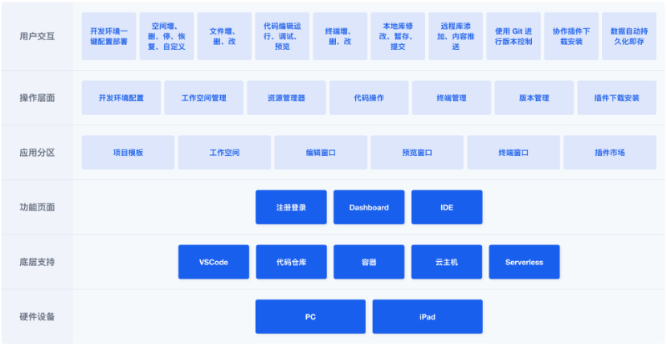
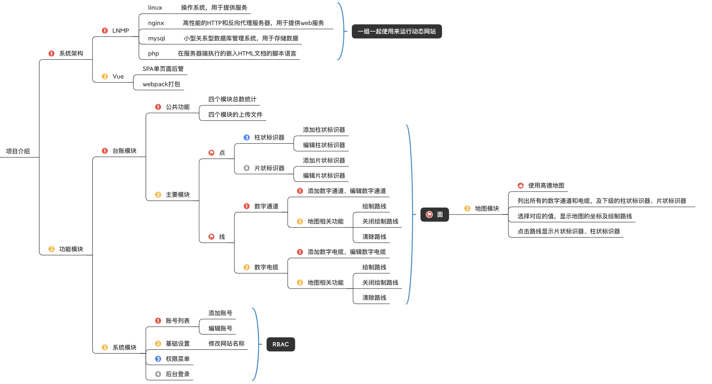
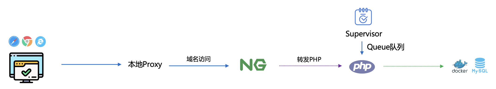
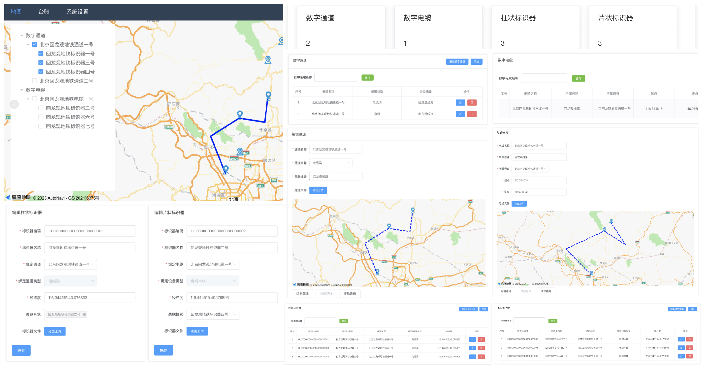

> 本项目来源于[《腾讯云 Cloud Studio 实战训练营》](https://marketing.csdn.net/p/06a21ca7f4a1843512fa8f8c40a16635)的参赛作品，该作品在腾讯云 [Cloud Studio](https://www.cloudstudio.net/?utm=csdn) 中运行无误。

Cloud Studio 活动演示案列前端Vue代码。

---

# 一、Cloud Studio 介绍：

[Cloud Studio](https://www.cloudstudio.net/?utm=csdn)是基于浏览器的集成式开发环境（IDE），为开发者提供了一个稳定的云端工作站。用户在使用 [Cloud Studio](https://www.cloudstudio.net/?utm=csdn) 时无需安装，随时随地打开浏览器就能使用。其功能包含代码高亮、自动补全、Git 集成、终端等 IDE 的基础功能，同时支持实时调试、插件扩展等，可以帮助开发者快速完成各种应用的开发、编译与部署工作。



---

# 二、系统技术体系：



Vue项目npm run dev，通过本地proxy代理访问后端PHP的项目技术体系结构。



项目页面功能截图快照。



---

# 三、安装软件：

## 1. 安装 Node 服务。

```js
apt-get install -y nodejs
apt-get install -y npm
```

## 2. Vue基目的项目：

将域名复制到map-vue项目中的.env.development文件中，替换掉VUE_APP_BASE_API的接口，不需要去vue.config.js中设置proxy代理接口。


